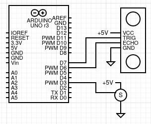

# Simple Arduino Sonar Interface

This is a simple aplication and Arduino sketch to display a sonar like interface in conjunction with a servo motor and a `HC-SR04` sensor.

The Arduino reads the sensor and sends the data to the application via serial communication. You can connect to the Arduino, change the motor speed, the aperture angles and the max distance all from the application.

The application is based on `Electron` and `React.js`. You can compile and install the application or just used in development mode.

___
### Wiring

For the wiring you will need an Ardunio (the project was tested with an `UNO` and a `nano`, but anyone should work) a servo motor (`SG90`) and an ultrasonic sensor, I use the `HC-SR04`, but the sketch can be easily modified to work with any other sensor.

For the `HC-SR04`, connect `trigger` to pin `D7`, `echo` to pin `D6` and `VCC` and `GND` accordingly.

And for the servo motor, connect the data pin to `D3` and of course `VCC` and `GND`.k

The ultrasonic sensor must be mounted of top of the servo motor.

___

### Arduino Sketch

The sketch is located in the `sensor` folder, it includes the library to use the `HC-SR04` sensor, but you must install the `Servo` standard library. You can find it in the Library Manager.

___

### Electron Application

The visual application is in the `render` folder. This folder contains only the application source code and the only prerequisite is that you must have already installed `node.js`

To start, open a terminal in the `render` folder and run:

    npm install

This will install all dependencies locally, after that run:

    npm run dev

And the window application must appear.

If you prefer, you can compile and install the application. Run one of the following commands depending on your operative system

    npm run build:win
    npm run build:mac
    npm run build:linux

Check the generated `out` directory and proceed with the installation.

Ones the application is running, open the settings and select the Arduino serial port, click on `connect` and ones the `connected` and `ready` indicators turn blue you can start reading the sensor.

